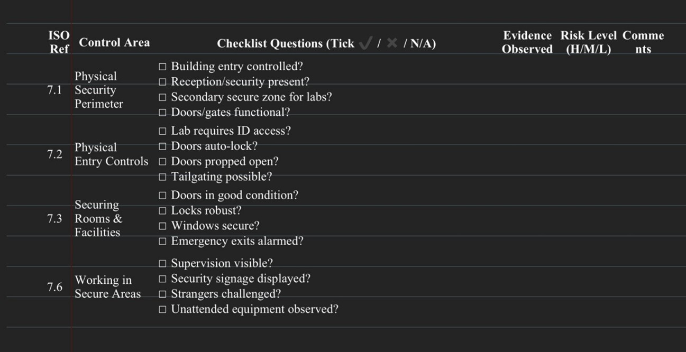
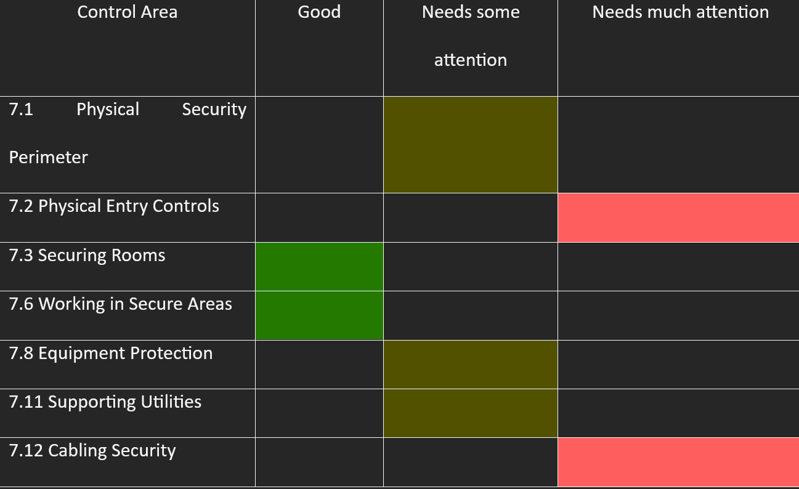

Below are the key tasks completed as part of this project.

<!-- Task 1 -->

  

    <h4 class="mb-3" style="border-left: 4px solid #0d6efd; padding-left: 12px;">ISO 27002:2022 Physical Security Audit</h4>
    
Designed a structured audit checklist aligned to ISO 27002:2022 Section 7 physical security controls, then conducted independent fieldwork across two university buildings to gather evidence. Findings were recorded against each control, risk-rated, and compiled into a formal audit report supported by two Work-in-Progress reports tracking methodology and progress. A gap analysis was then produced, revealing 57.2% non-compliance and prioritised recommendations for remediation.

    

      

        <figure class="text-center mb-0">
          
          <figcaption class="text-muted fst-italic mt-1" style="font-size:0.85rem">Audit Checklist</figcaption>
        </figure>
      

      

        <figure class="text-center mb-0">
          
          <figcaption class="text-muted fst-italic mt-1" style="font-size:0.85rem">Gap Analysis</figcaption>
        </figure>
      

    

  

<!-- PDF Toggle -->

  <button class="btn btn-outline-primary" type="button" data-bs-toggle="collapse" data-bs-target="#pdfReportAS" aria-expanded="false" aria-controls="pdfReportAS">
    View Full Report (PDF)
  </button>
  

    <iframe src="../pdfs/AS.pdf" width="100%" height="850px" style="border: 1px solid #dee2e6; border-radius: 8px;"></iframe>
  

