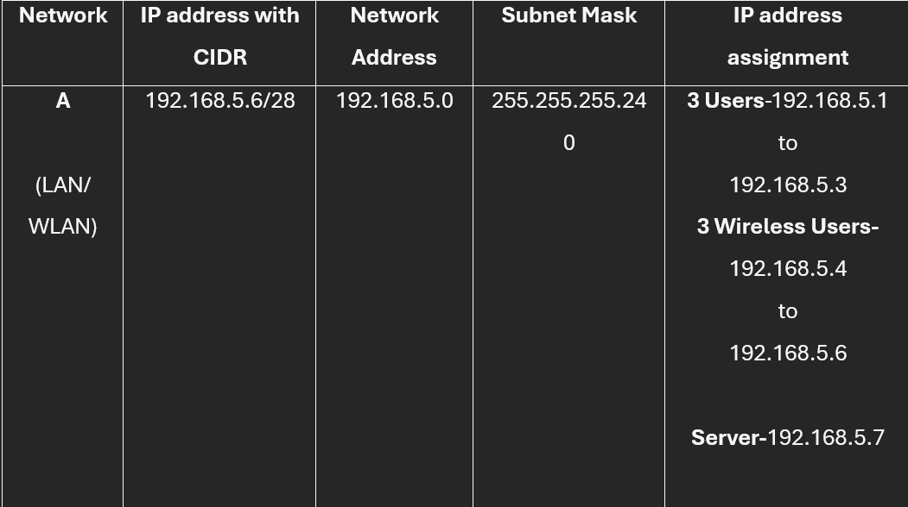
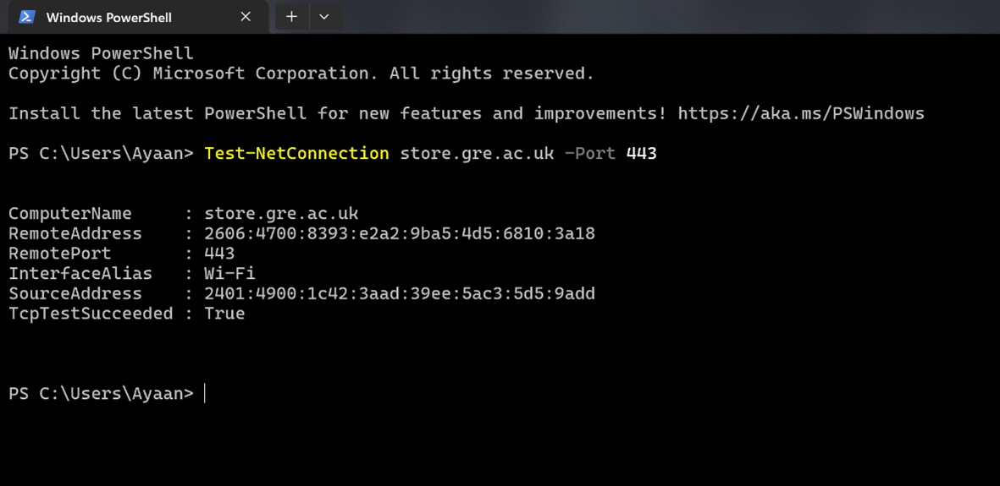
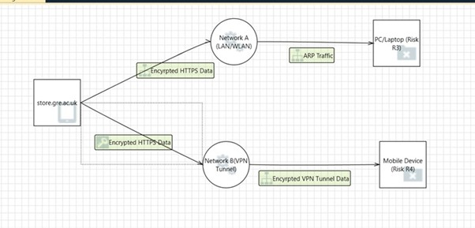

Below are the key tasks completed as part of this project.

<!-- Task 1 -->

  

    <h4 class="mb-3" style="border-left: 4px solid #0d6efd; padding-left: 12px;">Dual Network Design, Secure Communications and Connection Verification</h4>
    
The objective of this task was to design and analyse a secure dual-network infrastructure for Company X. The network design consisted of two separate environments: Network A, which included a Local Area Network (LAN) and Wireless Local Area Network (WLAN) for office-based users, and Network B, which provided remote access through a Virtual Private Network (VPN). The task required the creation of a detailed network diagram with their IP addresses showing communication between computers, smartphones, and the company website.

    

      

        <figure class="text-center mb-0">
          
          <figcaption class="text-muted fst-italic mt-1" style="font-size:0.85rem">Dual Network Diagram</figcaption>
        </figure>
      

      

        <figure class="text-center mb-0">
          
          <figcaption class="text-muted fst-italic mt-1" style="font-size:0.85rem">IP Address</figcaption>
        </figure>
      

    

  

<!-- Task 2 -->

  

    <h4 class="mb-3" style="border-left: 4px solid #0d6efd; padding-left: 12px;">Security Verification and Packet Analysis</h4>
    
Using the “test-netConnection” command in windows PowerShell to verify that the website uses port 443 which ensures it is a secure connection. 

    

      

        <figure class="text-center mb-0">
          
          <figcaption class="text-muted fst-italic mt-1" style="font-size:0.85rem">Testing Connection</figcaption>
        </figure>
      

    

  

<!-- Task 3 -->

  

    <h4 class="mb-3" style="border-left: 4px solid #0d6efd; padding-left: 12px;">Risk Assessment and Threat Modelling</h4>
    
Using the Microsoft threat modelling tool, risks were analysed to determine how attackers could exploit the weaknesses in both the website and dual network. The tool identified risks such as spoofing and elevation of privileges. The tool also provided recommended mitigation for these threats. For spoofing, the tool suggestion was to use strong authentication such as certificate validation or HTTPS and for threats such as impersonation MFA was suggested by the tool. For VPN, suggestion was to use strong VPN authentication and modern protocols. Implementing these measures can reduce the likelihood of the risks. 

    

      

        <figure class="text-center mb-0">
          
          <figcaption class="text-muted fst-italic mt-1" style="font-size:0.85rem">Model for Risk Evaluation</figcaption>
        </figure>
      

      

        <figure class="text-center mb-0">
          
          <figcaption class="text-muted fst-italic mt-1" style="font-size:0.85rem">Threat List</figcaption>
        </figure>
      

    

  

