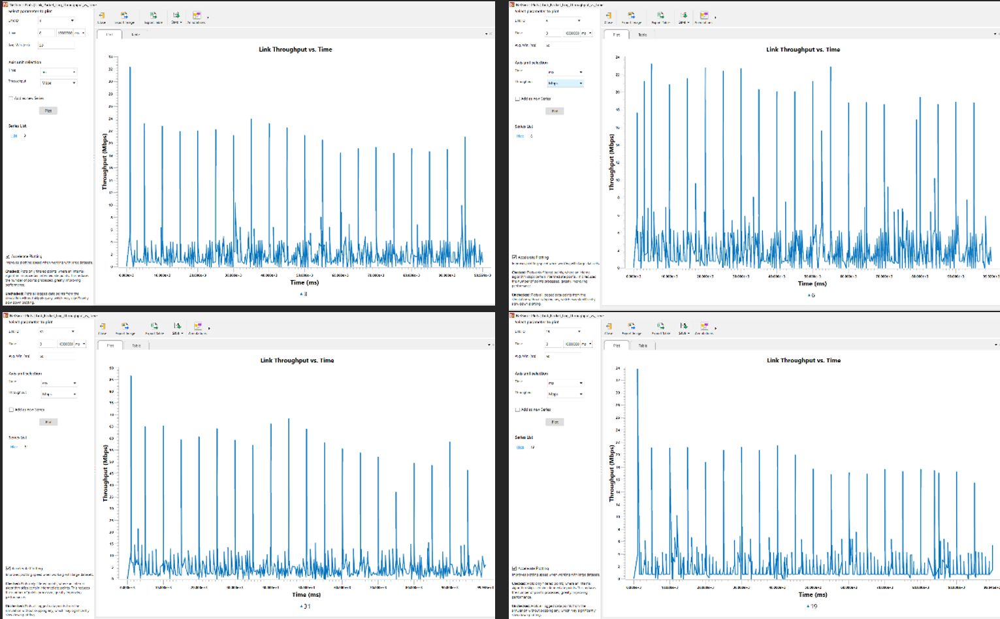
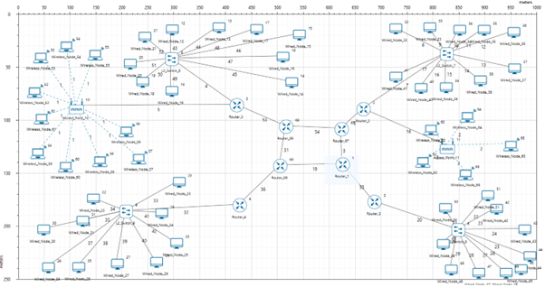
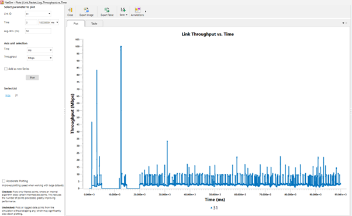

Below are the key tasks completed as part of this project.

<!-- Task 1 -->

  

    <h4 class="mb-3" style="border-left: 4px solid #0d6efd; padding-left: 12px;">Network Design and Simulation</h4>
    
Designed and implemented a multi-office enterprise network in Tetcos NetSim based on the provided business scenario. This involved creating LAN and WAN topologies for Cape Town, Singapore, Buenos Aires, and the NOC while configuring switches, routers, servers, and user devices. The task required configuring applications such as MS Teams, Zoom, OneDrive, email, and web browsing, then simulating realistic traffic flows and documenting all design decisions and performance settings.

    

      <figure class="text-center w-50">
        
        <figcaption class="text-muted fst-italic mt-1" style="font-size:0.85rem">Network Design</figcaption>
      </figure>
      <figure class="text-center w-50">
        
        <figcaption class="text-muted fst-italic mt-1" style="font-size:0.85rem">Network Traffic Simulation</figcaption>
      </figure>
    

  

<!-- Task 2 -->

  

    <h4 class="mb-3" style="border-left: 4px solid #0d6efd; padding-left: 12px;">Subnetting and IP Addressing</h4>
    
Created subnetting schemes for LAN, WAN, and MAN connections using private IP address ranges. The task required calculating network addresses, broadcast addresses, usable host ranges, and assigning IP addresses to devices within the topology. To solve this task, subnetting techniques and VLSM principles were applied to ensure efficient address allocation and proper communication between offices.

    

      <figure class="text-center">
        
        <figcaption class="text-muted fst-italic mt-1" style="font-size:0.85rem">Subnet Table</figcaption>
      </figure>
    

  

<!-- Task 3 -->

  

    <h4 class="mb-3" style="border-left: 4px solid #0d6efd; padding-left: 12px;">Network Performance Analysis</h4>
    
Analysed the behaviour and performance of the simulated network under multiple scenarios. This involved generating graphs, collecting simulation statistics, forming hypotheses, and comparing expected outcomes against actual results. The task required identifying congestion points, evaluating traffic behaviour, and explaining how network conditions affected overall performance.

    

      <figure class="text-center w-50">
        
        <figcaption class="text-muted fst-italic mt-1" style="font-size:0.85rem">Performance Analysis 1</figcaption>
      </figure>
      <figure class="text-center w-50">
        
        <figcaption class="text-muted fst-italic mt-1" style="font-size:0.85rem">Performance Analysis 2</figcaption>
      </figure>
    

  

<!-- Task 4 -->

  

    <h4 class="mb-3" style="border-left: 4px solid #0d6efd; padding-left: 12px;">Advanced Performance Metrics Investigation</h4>
    
Investigated specific Quality of Service (QoS) and performance metrics including backbone link utilisation, OneDrive file download times, web server response times, MS Teams/Zoom behaviour, and Ethernet delays. Solving this task required configuring detailed simulation statistics in NetSim, interpreting graphical outputs, and identifying bottlenecks or inefficiencies affecting user experience and communication quality.

    

      <figure class="text-center">
        
        <figcaption class="text-muted fst-italic mt-1" style="font-size:0.85rem">Advanced Performance Metrics</figcaption>
      </figure>
    

  

<!-- Task 5 -->

  

    <h4 class="mb-3" style="border-left: 4px solid #0d6efd; padding-left: 12px;">Network Optimisation and Improvements</h4>
    
Evaluated the weaknesses identified during testing and proposed improvements to the network design. This included optimising bandwidth allocation, reducing bottlenecks, improving routing efficiency, and enhancing overall QoS. The task required comparing baseline and improved simulation results to justify the effectiveness of the implemented changes.

    

      <figure class="text-center w-50">
        
        <figcaption class="text-muted fst-italic mt-1" style="font-size:0.85rem">Improved Topology</figcaption>
      </figure>
      <figure class="text-center w-50">
        
        <figcaption class="text-muted fst-italic mt-1" style="font-size:0.85rem">Link Performance during Link Failure</figcaption>
      </figure>
    

  

